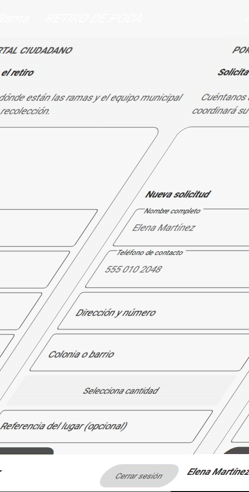
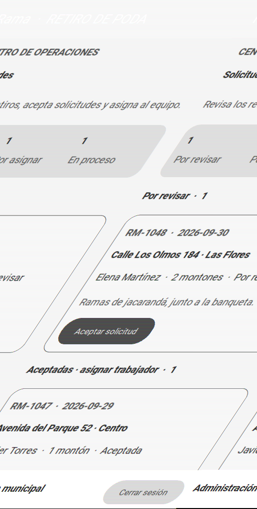
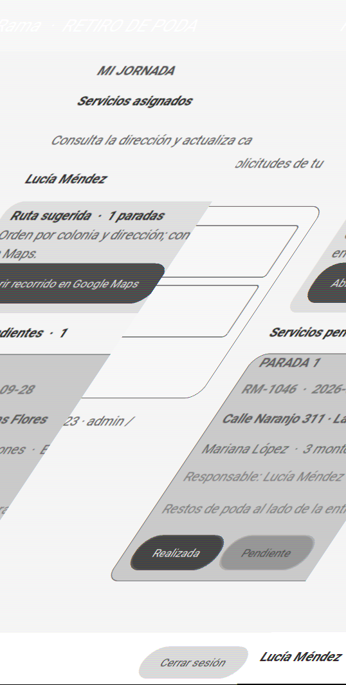

# Rama | Retiro de poda

**Problema que resuelve:** coordina el retiro municipal de ramas y restos de poda que se acumulan frente a las viviendas.

**Usuarios objetivo:** ciudadanos que solicitan un retiro, administración municipal que revisa y asigna solicitudes, y trabajadores que realizan la recolección.

Rama es una app móvil construida con Python, Kivy y KivyMD para digitalizar este flujo municipal. Incluye inicio de sesión y tres áreas privadas dentro de `ScreenManager`. La interfaz se declara en `rama.kv`; eventos, lógica y validaciones están en `main.py`.

## Ejecutar

Requisitos: Python 3.11.6. En Windows, desde la carpeta del proyecto:

```powershell
py -3.11 -m venv .venv
.\.venv\Scripts\Activate.ps1
python -m pip install --upgrade pip
pip install -r requirements.txt
python main.py
```

Pruebas de la lógica:

```powershell
python -m unittest -v
```

## Cuentas de demostración

| Perfil | Usuario | Contraseña |
| --- | --- | --- |
| Ciudadana Elena Martínez | `elena` | `elena123` |
| Ciudadano Javier Torres | `javier` | `javier123` |
| Ciudadana Mariana López | `mariana` | `mariana123` |
| Ciudadano Carlos Díaz | `carlos` | `carlos123` |
| Administración municipal | `admin` | `admin123` |
| Trabajadora Lucía Méndez | `lucia` | `lucia123` |
| Trabajador Diego Rojas | `diego` | `diego123` |
| Trabajador Mateo Silva | `mateo` | `mateo123` |

Son cuentas fijas para la demostración académica, no credenciales reales. No usar en producción.

## Flujo de la demo

1. **Ciudadano:** llena el formulario y envía una solicitud.
2. **Administración:** acepta la solicitud y asigna una persona del equipo.
3. **Trabajador:** inicia sesión con su propia cuenta, ve sus paradas ordenadas por colonia/dirección, abre el recorrido en Google Maps, inicia el retiro y lo marca realizado o pendiente con un motivo.

Hay solicitudes de ejemplo para recorrer todas las etapas. El enlace a Maps usa las direcciones ingresadas; el orden es una sugerencia simple, no optimización de tránsito ni validación de geolocalización. Los datos y las cuentas son locales y se reinician al cerrar la app. La autenticación es demostrativa, no protege datos reales ni comparte solicitudes entre dispositivos; producción requiere un backend municipal con contraseñas seguras, permisos y geocodificación.

## Capturas de la app ejecutándose







Para regenerarlas: `python capturar_pantallas.py`.

## Declaración de uso de IA

Se utilizó GitHub Copilot como apoyo para estructurar y revisar código y documentación. El equipo debe revisar y adaptar el material, y completar la fundamentación con resultados obtenidos directamente de participantes.
